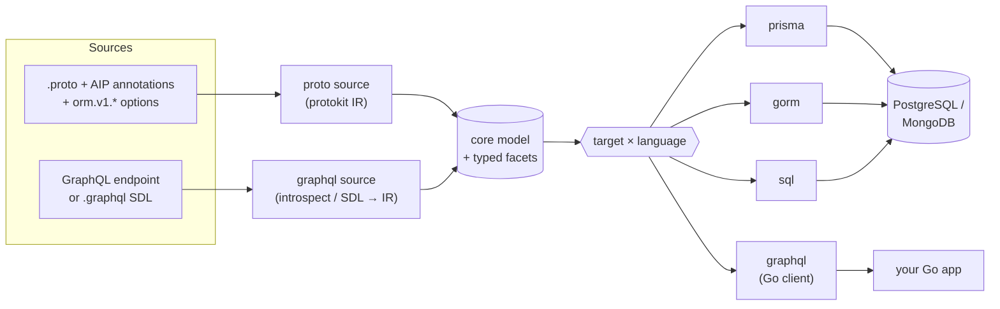
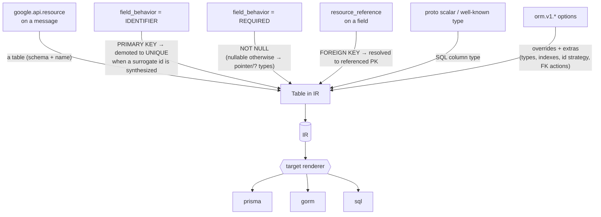
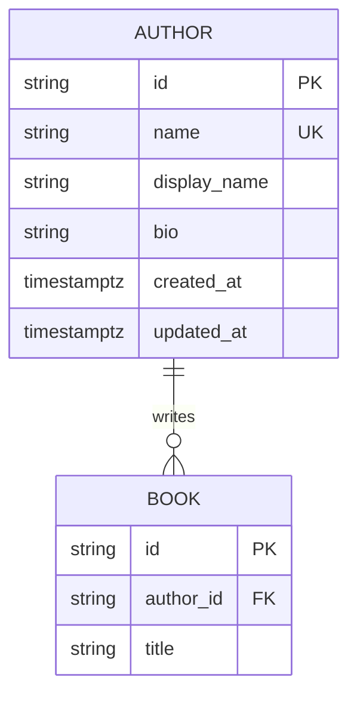
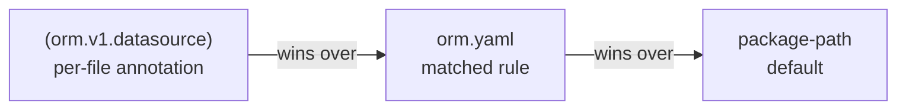

# ORM

> **One contract, many targets.** `protoc-gen-orm` is a co-generation factory:
> feed it **Protobuf** (annotated with [Google AIP](https://google.aip.dev/)) and it
> emits production-grade **Prisma, GORM, and PostgreSQL** schemas; feed it a
> **GraphQL** endpoint or `.graphql` SDL and it emits a typed **Go client**. One
> binary, one `orm.yaml`, outputs that always agree.

[](https://github.com/the-protobuf-project/orm/releases)
[](https://pkg.go.dev/github.com/the-protobuf-project/orm)
[](go.mod)
[](https://buf.build/the-protobuf-project/orm)
[](https://github.com/the-protobuf-project/orm/actions/workflows/test.yaml)
[](LICENSE)

## Contents

- [Overview](#overview)
- [Features](#features)
- [Architecture](#architecture)
- [How it works](#how-it-works)
- [Install](#install)
- [Quick start](#quick-start)
- [Output layout](#output-layout)
- [GraphQL client SDK](#graphql-client-sdk)
- [Annotations reference](#annotations-reference)
- [Configuration — `orm.yaml`](#configuration--ormyaml)
- [Plugin options](#plugin-options)
- [Defaults applied automatically](#defaults-applied-automatically)
- [Determinism & migrations](#determinism--migrations)
- [Type mapping](#type-mapping)
- [Examples](#examples)
- [Building from source](#building-from-source)
- [Releases & versioning](#releases--versioning)
- [License](#license)

## Overview

**orm** is a single binary, `protoc-gen-orm`, built as a **co-generation factory** —
a `source → target × language` pipeline. A *source* turns a contract into a neutral
model; a *target* renders that model into code. Two sources ship today:

- **proto** — a [protoc](https://protobuf.dev/) plugin. Annotate messages with the
  [Google AIP](https://google.aip.dev/) standards you already use
  (`google.api.resource`, `field_behavior`, `resource_reference`) and orm infers
  tables, columns, primary keys, foreign keys, and relations.
- **graphql** — point it at a live GraphQL endpoint (or a cached `.graphql` SDL file)
  and it introspects the schema.

Both run through the same binary on `buf generate`, selected per output by a
`target=` plugin entry; everything else lives in one [`orm.yaml`](#configuration--ormyaml).

| Source | Target | Output |
| --- | --- | --- |
| proto | **prisma** | A complete, runnable Prisma 7 project — multi-file schema, `package.json`, `tsconfig.json`, config, a pre-filled `.env` + `.env.example`. |
| proto | **gorm** | Go structs with GORM tags + a migration registry; optional [CRUD stores + first-party telemetry](#gorm-stores-and-tracing), [AIP-160 filter / AIP-132 order_by list engines for **SQL and Hasura GraphQL**](#aip-160-filters-and-list-engines-sql--hasura), and [proto ↔ model converters](#proto--model-converters). |
| proto | **sql** | PostgreSQL DDL — per-schema reference files **and** one transactional, **idempotent** `migrate.sql`; FK constraints, indexes, `updated_at` triggers, `COMMENT ON`. |
| graphql | **graphql** | A typed Go GraphQL client — row models, a fluent predicate DSL, CRUD/subscription methods (see [GraphQL client SDK](#graphql-client-sdk)). |

Each database target also emits a `README.md` with a Mermaid ER diagram and a
per-model column reference, so the generated tree is self-documenting. Postgres and
MongoDB providers are both supported, and the GraphQL client speaks the
Hasura/DDN/Grafbase lineage through a pluggable [dialect](#dialects). Code emitters
are organized per language (Go today), so a target can grow Python/TypeScript/… output
by adding a template set beside the shared, language-agnostic parsing.

## Features

- **A co-generation factory.** One `source → target × language` pipeline. Sources
  (proto, GraphQL) turn a contract into a neutral model; targets render it. Adding a
  target or a source is a self-contained addition — the shared parsing, config, and
  emit machinery are reused. The proto IR engine
  ([protokit](https://github.com/the-protobuf-project/protokit)) is itself generic, so
  a sibling plugin ([web3](https://github.com/the-protobuf-project/web3)) renders a
  blockchain backend from the same model.
- **AIP-native.** ~80% of the proto schema is read straight from standard AIP
  annotations; only the remaining ~20% needs `orm.v1.*` options.
- **GraphQL client from a schema.** Point the `graphql` target at an endpoint or a
  `.graphql` SDL file and get a typed Go client — models, a predicate DSL, CRUD and
  subscriptions — behind a pluggable [dialect](#dialects) (Hasura/DDN/Grafbase today).
- **Ready for more languages.** Each code target keeps its language-specific templates
  under a per-language folder (Go now), so Python/Rust/TypeScript output is a new
  template set over the same parsing — not a rewrite.
- **Production defaults.** ULID surrogate keys, auto-managed timestamps,
  FK indexing, soft-delete markers, and enum hygiene — all overridable.
- **List queries built in — SQL and Hasura.** Opt-in [AIP-160](https://google.aip.dev/160)
  `filter` / [AIP-132](https://google.aip.dev/132) `order_by` engines: generated
  per-resource specs drive one shared `filterx` SDK whose **GORM (SQL)** and
  **Hasura DDN (GraphQL)** engines accept identical filter strings by
  construction — free-text search, sort allowlists, and opaque page tokens
  included.
- **Idempotent SQL.** The consolidated `migrate.sql` is transactional and guarded
  (`IF NOT EXISTS`, `CREATE OR REPLACE`, deferred FK `ALTER`s) — safe to re-apply.
- **Relational nesting.** Nested and imported value messages become real child
  tables (PK + FK), never opaque `JSONB` blobs — your structure stays queryable.
- **Monorepo layout.** An optional [`orm.yaml`](#configuration--ormyaml)
  maps proto packages to databases and schemas without per-file annotations.
- **Deterministic.** Re-running on unchanged protos produces byte-identical
  output (enforced by golden tests), so regenerate → `migrate diff` is a no-op.
- **Self-documenting.** Each target ships a `README.md` with a Mermaid ER diagram.

## Architecture

The factory is a `source → model → target` pipeline. A **source** turns an input
contract into a neutral model; a **target** renders that model. All of it lives in one
binary, configured by one [`orm.yaml`](#configuration--ormyaml).



Each source builds the model, then the selected target renders it independently. The
**parsing is language-agnostic** — a target's language-specific templates live under a
per-language folder, so adding Python/TypeScript output reuses the same model. On the
proto side, files that declare the **same datasource name merge into one database**, so
a multi-file proto package becomes a single schema tree; the proto IR is built by the
generic [protokit](https://github.com/the-protobuf-project/protokit) engine, which a
sibling plugin ([web3](https://github.com/the-protobuf-project/web3)) reuses for a
blockchain backend.

## How it works

Every annotation maps to a concrete piece of schema. orm collects them all
into the IR, applies its [production defaults](#defaults-applied-automatically),
then hands the IR to the selected renderer.



| Source annotation | Inferred output |
| --- | --- |
| `google.api.resource` on a message | a table; schema + name from `type` / `plural` |
| `field_behavior = IDENTIFIER` | `PRIMARY KEY NOT NULL` |
| `field_behavior = REQUIRED` | `NOT NULL` (nullable otherwise → pointer/`?` types) |
| `resource_reference` on a field | a `FOREIGN KEY`, resolved to the referenced PK |
| proto scalar / well-known type | the column's SQL type (see [Type mapping](#type-mapping)) |

## Install

```bash
# Homebrew (macOS / Linux)
brew install the-protobuf-project/tap/protoc-gen-orm

# or go install
go install github.com/the-protobuf-project/orm/plugin/cmd/protoc-gen-orm@latest
```

Releases ship prebuilt binaries for **linux / darwin / windows** on **amd64 / arm64**
on the [Releases page](https://github.com/the-protobuf-project/orm/releases).
The plugin must be on your `PATH` so `protoc`/`buf` can find it.

You'll also need the option definitions on your import path. With
[buf](https://buf.build), add the module to your `buf.yaml` `deps`:

```yaml
deps:
  - buf.build/the-protobuf-project/orm
```

then `import "orm/v1/annotations.proto";` in your protos.

## Quick start

**1. Annotate a proto.**

```proto
syntax = "proto3";
package bookstore.v1;

import "google/api/field_behavior.proto";
import "google/api/resource.proto";
import "orm/v1/annotations.proto";

option (orm.v1.datasource) = {
  database: "bookstore_db"
  provider: "postgres"
};

message Author {
  option (google.api.resource) = {
    type: "bookstore.v1/Author"
    pattern: "authors/{author}"
    singular: "author"
    plural: "authors"
  };
  // Use a generated ULID primary key + created_at/updated_at columns.
  option (orm.v1.table) = { id: ID_STRATEGY_ULID, timestamps: true };

  // IDENTIFIER → the AIP resource name; becomes a UNIQUE lookup column.
  string name = 1 [(google.api.field_behavior) = IDENTIFIER];

  // REQUIRED → NOT NULL; string defaults to VARCHAR(255).
  string display_name = 2 [(google.api.field_behavior) = REQUIRED];

  // Override the default for a free-form column.
  string bio = 3 [(orm.v1.column) = { type: "TEXT" }];
}
```

**2. Add the plugin to `buf.gen.yaml`.**

```yaml
version: v2
plugins:
  - local: protoc-gen-orm
    out: generated/prisma
    opt: [target=prisma]   # prisma | gorm | sql
```

**3. Generate.**

```bash
buf generate
```

> [!NOTE]
> orm doesn't generate Go message stubs, so protoc/buf needs a Go import
> path for each file. If your protos don't set `option go_package`, supply it
> per file in `opt:` with an `M` mapping, e.g.
> `Mbookstore/v1/bookstore.proto=example.com/gen/bookstore/v1`.

### What comes out

The `Author` message above produces, across targets — **Prisma:**

```prisma
model Author {
  id          String   @id @default(ulid()) @map("id")
  name        String   @unique @map("name")
  displayName String   @map("display_name")
  bio         String?  @map("bio")
  createdAt   DateTime @default(now()) @map("created_at")
  updatedAt   DateTime @updatedAt @map("updated_at")
  books       Book[]

  @@map("authors")
  @@schema("bookstore_v1")
}
```

**GORM:**

```go
type Author struct {
  ID          string    `gorm:"column:id;primaryKey;not null"`
  Name        string    `gorm:"column:name;not null;uniqueIndex"`
  DisplayName string    `gorm:"column:display_name;not null"`
  Bio         *string   `gorm:"column:bio"`
  CreatedAt   time.Time `gorm:"column:created_at;autoCreateTime"`
  UpdatedAt   time.Time `gorm:"column:updated_at;autoUpdateTime"`
  Books       []Book    `gorm:"foreignKey:AuthorID"`
}

func (*Author) TableName() string { return "bookstore_v1.authors" }
```

(`///` doc comments and `json`/`validate` tags are emitted too — trimmed here for space.)

And every target also drops a `README.md` with the relationships drawn out, e.g.:



## Output layout

Files that declare the **same datasource name merge into one database**, so a
multi-file proto package becomes a single schema tree. Each target lays its
output out to match:

```text
generated/prisma/bookstore_db/
├── schema.prisma                          # datasource + generator blocks
├── bookstore_db.config.ts                 # Prisma 7 config (URL via env)
├── package.json, tsconfig.json            # runnable project scaffold
├── .env, .env.example, .gitignore, README.md  # .env is pre-filled from the datasource url (git-ignored)
├── bookstore_v1/bookstore.postgres.prisma # models & enums, one file per source proto
└── inventory/inventory.postgres.prisma    # (a second file, merged datasource)

generated/gorm/bookstore_db/bookstorev1/models.go        # package = folder name
generated/gorm/bookstore_db/bookstorev1/author_store.go  # typed CRUD store (stores opt)
generated/gorm/bookstore_db/bookstorev1/filters.go       # AIP-160/132 filter & sort specs (filters opt)
generated/gorm/bookstore_db/bookstorev1/protobuf.go      # proto ↔ model converters (converters opt)
generated/gorm/gormx/gormx.go                       # shared runtime: ListOptions, Store[M], engine (stores opt)
generated/gorm/filterx/                             # shared filter/order/list engines: SQL + Hasura (filters opt)
generated/gorm/bookstore_db/migrate.go              # factory Registry + EnsureSchemas + Instrument (needs go_module)
generated/gorm/bookstore_db/README.md               # ER diagram + model reference
generated/sql/bookstore_db/migrate.sql              # whole DB, one transactional file
generated/sql/bookstore_db/bookstore_v1.postgres.sql
generated/sql/bookstore_db/README.md
```

The Prisma output is a project you can run immediately:

```bash
cd generated/prisma/bookstore_db
npm install                 # .env ships pre-filled from the proto datasource url
npm run prisma:generate
```

The emitted `.env` is git-ignored and pre-populated with the datasource `url`
from your proto — edit it locally if your credentials differ (`.env.example`
stays as the committed reference).

The **gorm** target emits a `migrate.go` factory registry (when you pass the
`go_module` opt, see [Plugin options](#plugin-options)). Attach it in your
application — one call migrates every model across every schema, and you can
register your own models alongside the generated ones:

```go
import bookstoredb "github.com/me/gen/bookstore_db"

if err := bookstoredb.Default.EnsureSchemas(db); err != nil { // create Postgres schemas first
    log.Fatal(err)
}
if err := bookstoredb.Default.Migrate(db); err != nil { // db is your *gorm.DB
    log.Fatal(err)
}
bookstoredb.Default.Register(&MyModel{})  // add your own to the same registry
```

### GORM stores and tracing

Two opt-in extras layer onto the gorm target's runtime:

**Stores** (`stores` opt, also needs `go_module`) generate a typed CRUD store per
resource — one small `<model>_store.go` file each — plus a shared `gormx` runtime
package they all import, so you don't hand-write the boilerplate. Each store is
derived entirely from the resource's schema (PK, unique columns, foreign keys):

```go
store := bookstorev1.NewAuthorStore(db)

a, err := store.GetByID(ctx, id)                 // primary key
a, err = store.GetByName(ctx, "authors/rowling") // a UNIQUE column → GetBy<Col>
list, err := store.List(ctx, gormx.ListOptions{Limit: 20, OrderBy: "display_name"})
n, err := store.Count(ctx, gormx.ListOptions{})
books, err := bookstorev1.NewBookStore(db).
    ListByAuthorID(ctx, a.ID, gormx.ListOptions{}) // a foreign key → ListBy<FK>
```

Every store exposes `Create`, `GetByID`, `List`, `Count`, `Update`, `DeleteByID`,
plus `GetBy<Col>` finders for unique columns (including single-column unique
indexes) and `ListBy<FK>` finders for foreign keys. The shared `gormx` package
holds `ListOptions` (`Limit` / `Offset` / `OrderBy` / `Where` + `Args`), a generic
`Store[M]` interface every store satisfies, and a `GenericStore[M]` engine that
runs CRUD for any model — so one engine can drive every entity. Enabling `stores`
adds a `gorm.io/gorm` dependency to the models package.

**Telemetry** (`telemetry` opt, **off by default**) folds first-party
[opentelementry](https://github.com/the-protobuf-project/opentelementry)
observability into the generated tree — spans, per-operation metrics, and
trace-correlated logs — with no third-party otel library involved. Every
generated store gains a `Telemetry gormx.Telemetry` field (nil is a no-op,
so existing callers keep compiling) and a `WithTelemetry` chainer; wire the
generated adapter once and every instrumented store, and the migration
`Registry`, observe through it:

```go
o, err := opentelementry.New().
    WithService("bookstore-api", "1.0.0").
    WithOTLP("localhost", 4317).
    WithTracing().
    Build()
if err != nil {
    log.Fatal(err)
}
defer o.Close()

if err := bookstoredb.Default.Instrument(db, o); err != nil { // SQL-level spans/metrics
    log.Fatal(err)
}
store := bookstorev1.NewAuthorStore(db).WithTelemetry(ormtelemetry.New(o)) // per-store spans/metrics
```

Mark low-cardinality fields as span labels with
[`(orm.v1.telemetry_field)`](#ormv1telemetry_field--field-level) (e.g. a book's
`genre`); tune a table's span prefix or opt it out entirely with
[`(orm.v1.telemetry)`](#ormv1telemetry--message-level). Metrics stay scoped to
the database operation itself (table, op, status, duration) by design —
domain-level metrics belong to the application, not the ORM. It needs
`go_module` (the adapter package lives alongside the aggregator) and adds the
`github.com/the-protobuf-project/opentelementry/opentelementry-go` dependency.
Tune the generated default — including metrics/logs-off — via
[`orm.yaml` `telemetry:`](#top-level-keys).

### AIP-160 filters and list engines (SQL + Hasura)

The `filters` opt (gorm target, needs `go_module`) generates the complete
list-query surface for every resource — [AIP-160](https://google.aip.dev/160)
`filter`, [AIP-132](https://google.aip.dev/132) `order_by`, and pagination —
as **specs (data) + engines (code)**:

- `<schema>/filters.go` — a `filterx.Spec` per resource: the filterable fields
  with type-derived operator kinds (text, enum, date, timestamp, int, bool,
  tags, reference), the free-text `Search` columns, and the `order_by`
  allowlist. Tune what each field exposes with
  [`(orm.v1.query)`](#ormv1query--field-level).
- `filterx/` — one shared, chainable SDK package holding the engines the specs
  drive. `filterx.Gorm[M]` renders parsed conditions to SQL on a `*gorm.DB`;
  `filterx.Hasura[M]` renders the **same filter strings** to Hasura DDN
  GraphQL `BoolExp` predicates — so a gRPC/REST list endpoint and a
  Hasura-backed GraphQL API accept identical filters by construction.

```go
// SQL — pass a *gorm.DB already parent-scoped and preloaded; the engine
// only adds filter / order / pagination.
rows, next, err := filterx.Gorm[bookstorev1.Author](bookstorev1.AuthorFilterSpec).
    List(ctx, db, in) // in: filterx.ListInput{PageSize, PageToken, OrderBy, Filter}

// GraphQL — same spec, same filter strings, over a Hasura DDN query handler.
rows, next, err = filterx.Hasura[bookstorev1.Author](bookstorev1.AuthorFilterSpec, queryHandler).
    Scope(scopePredicates...). // fixed predicates ANDed into every query
    List(ctx, in)
```

Both engines share one set of semantics, so the backends always agree: enum
values normalize (`ROOM` and `UNIT_TYPE_ROOM` both match), dates and numbers
validate **before** any query runs, `:` does a case-insensitive contains with
ILIKE escaping, bareword terms (`filter: "beach resort"`) match the `search`
columns, resource-reference fields compare the bare id segment
(`operator = "operators/op1"` and `= "op1"` are equivalent), and results
paginate limit+1 with an opaque page token. Invalid filter/order input is
rejected with `filterx.ErrInvalid` — translate it to your invalid-argument
error (e.g. gRPC `InvalidArgument`) with `errors.Is`.

**Distributed tracing into Hasura's own engine spans**: Hasura DDN's engine
(`ddn-engine`) emits its own OTEL spans (parse/validate/plan/execute) and
accepts a standard W3C `traceparent` header on the incoming request — set
`TracePropagator: propagation.TraceContext{}` on the `network.ConnectionOptions`
your generated GraphQL client connects with, and every query issued through a
context carrying an active span (e.g. inside `tel.Span(ctx, ...)` from
[Telemetry](#gorm-stores-and-tracing), or any `go.opentelemetry.io/otel` span)
has Hasura's engine spans nest as children of yours in the same trace —
verified against a live `ddn-engine` + Tempo. No orm codegen involved: this is
a `runtime-go/network` capability the generated `queryHandler` already threads
`ctx` through to, the same way `Headers` carries auth tokens today.

Every engine is tunable through its chainable options: `Override` installs a
custom handler for one filter field (the escape hatch for derived predicates
the schema can't express), and `Observe` plugs an `Observer` in for query spans
and rejected-input debug events. The `telemetry` opt additionally emits a
ready-made [opentelementry](https://github.com/the-protobuf-project/opentelementry)
observer adapter (`filterx.OpentelementryObserver`). The Hasura engine adds a
dependency on `github.com/the-protobuf-project/runtime-go` (its `graphql`
package).

### Proto ↔ model converters

The `converters` opt (gorm target) emits a `protobuf.go` per schema package
with a mapper pair per resource — `<Model>ToProto` / `<Model>FromProto` — plus
per-enum value mappers. The converters cover the mechanical field mass:
scalars, enums, temporals, arrays, JSON, optional fields (pointer-wrapped
where the model is a pointer; `bytes` stays `[]byte`), and belongs-to value
objects on the read side. They deliberately **don't** invent data or wiring the
schema can't know:

- synthesized columns (surrogate ids, audit timestamps) are never set from
  proto input; audit timestamps still render back out;
- resource-reference columns are skipped in both directions — the
  resource-name ↔ id mapping stays with the caller;
- relationalized sub-rows (value objects) render `ToProto` from their preloaded
  associations, but `FromProto` graph wiring (fresh ids, FK assignment, insert
  order) stays with the caller, composing each sub-row's own `FromProto`.

The **sql** target emits one transactional `migrate.sql` you can apply in a
single shot — foreign keys are deferred to `ALTER` statements (so creation order
never matters) and every statement is guarded (`IF NOT EXISTS`, `CREATE OR
REPLACE`, a `DO`-block for enums), so the file is **idempotent and safe to
re-apply**. The per-schema files remain as clean, readable reference DDL.

```bash
psql "$BOOKSTORE_DB_DATABASE_URL" -f generated/sql/bookstore_db/migrate.sql
```

## GraphQL client SDK

The same `protoc-gen-orm` binary also generates a **typed Go GraphQL client** from
a live server. Where the proto flow is `proto → database schema`, this flow is
`GraphQL introspection → Go client` — a second *source* into the same
co-generation factory. There is **no separate CLI**: it runs as a normal target
during `buf generate`. Add a plugin entry with `target=graphql` and point it at the
endpoint via `orm.yaml`:

```yaml
# orm.yaml
graphql:
  endpoint: https://api.example.com/graphql   # or `schema: schema.graphql` (a cached GraphQL SDL file)
  admin_secret: env:HASURA_ADMIN_SECRET       # sent under the dialect's auth header
  dialect: hasura
generate:
  - target: graphql
    go_module: github.com/me/app/gql          # import path of the emitted package
    # package: appql            # defaults to base(go_module)+"ql"
    # dump_schema: true         # also write <package>/schema.json
```

```yaml
# buf.gen.yaml — the endpoint/output details live in orm.yaml; the entry is minimal
plugins:
  - local: protoc-gen-orm
    out: gen                    # buf writes the client tree here
    opt: [target=graphql, config=orm.yaml]
```

`buf generate` then introspects the endpoint and writes the client through the
plugin response into `out:`. The output is a self-contained library — typed row
models, a fluent predicate DSL (`Id.Eq(x)`, `And`/`Or`/`Not`), single-object
create/update inputs, and one method per query/mutation/subscription, in
per-domain `…ql` packages on a small transport runtime. Every handler satisfies
the generic `graphql.QueryHandler[M]` / `graphql.MutationHandler[…]` interfaces
from [`runtime-go`](https://github.com/the-protobuf-project/runtime-go) — the
**same interface the gorm target's [`filterx.Hasura[M]`](#aip-160-filters-and-list-engines-sql--hasura)
list engine consumes** — so a generated client plugs straight into the AIP-160
filter engine with zero glue.

> [!NOTE]
> Because this runs under buf, the buf module's protos still need a Go import path
> (a `go_package` option or an `M` mapping) even though the `graphql` target
> ignores them — buf compiles the module before invoking any plugin.

### Dialects

The engine-specific conventions (bool_exp combinators, `_eq`/`_in` comparisons,
`insert`/`update`/`delete` verb prefixes, `returning` / `affectedRows` mutation
responses, the `x-hasura-admin-secret` auth header, scalar mappings) live behind
a pluggable **dialect**. The built-in `hasura` dialect covers the Hasura / DDN /
Grafbase / Prisma-GraphQL lineage; select it (or a future engine) with
`--dialect` or the `graphql.dialect` key in `orm.yaml`. Adding another GraphQL
database is a new dialect value plus a registry entry — the IR builder and
renderer never hardcode a convention. CRUD/filter/aggregate detection itself is
derived from introspection, not hardcoded, so unconventional schemas still
generate compiling code.

Generated files are collision-proof: if a schema name would clash with the
runtime `graphql`/`runtime` import identifiers, the import is deterministically
aliased (`gqlnet`/`rtnet`) and its references rewritten, so the output always
compiles regardless of the source schema's naming.

## Annotations reference

Schema options live in `orm/v1/annotations.proto`; the list-query options live
in `orm/v1/query.proto`.

### `(orm.v1.datasource)` — file level

| Field | Description |
| --- | --- |
| `database` | Database name. Files sharing a name merge into one tree. Defaults to the last proto package segment. |
| `schema` | Override the schema namespace for every table in the file. |
| `url` | Connection URL (documented in config/DDL; Prisma reads it from `.env`). |
| `provider` | `postgres` (default) or `mongodb`. |

### `(orm.v1.table)` — message level

| Field | Description |
| --- | --- |
| `table` | Explicit table name. Defaults to the snake_case plural of the resource. |
| `skip` | Exclude the message from all output. |
| `indexes` | Composite indexes: `{ columns: [...], unique: bool, index: "..." }`. |
| `id` | `ID_STRATEGY_ULID` / `ID_STRATEGY_UUID` — synthesize a generated `id` PK and demote the `IDENTIFIER` field to `UNIQUE`. |
| `timestamps` | Add `created_at` / `updated_at` (`@updatedAt` / GORM `autoUpdateTime`). |

### `(orm.v1.column)` — field level

| Field | Description |
| --- | --- |
| `column` | Explicit column name (defaults to the proto field name). |
| `type` | Explicit SQL type (escape hatch; prefer the sizing options below). |
| `max_length` | `VARCHAR(n)` instead of the `VARCHAR(255)` default — provider-neutral. |
| `precision` / `scale` | `NUMERIC(p, s)`. |
| `default_value` | SQL default expression, written verbatim. |
| `unique`, `index` | Single-column constraint / index. |
| `skip` | Field exists in the proto contract but not the database. |
| `on_delete` / `on_update` | FK referential action (`CASCADE`, `SET_NULL`, …) for a `resource_reference` field. |

### `(orm.v1.query)` — field level

Tunes the field's generated list-query surface — the [AIP-160 filter / AIP-132
order_by specs](#aip-160-filters-and-list-engines-sql--hasura) — separately
from the physical column options:

```proto
string display_name = 2 [(orm.v1.query) = { search: true }];
string state = 5 [(orm.v1.query) = { filterable: false, sortable: false }];
```

| Field | Description |
| --- | --- |
| `filterable` | Override the type-derived default in the generated filter spec (scalar columns are filterable by default, operators inferred from the type). Presence matters: `filterable: false` removes the field; unset keeps the default. |
| `sortable` | Override the type-derived default in the `order_by` allowlist (scalar, date, timestamp, and numeric columns sort by default). Presence matters, as with `filterable`. |
| `search` | Include the column in bareword free-text search — a filter term with no field (e.g. `beach resort`) matches it with a case-insensitive contains. Off by default. |

### `(orm.v1.telemetry)` — message level

Tunes a table's generated [telemetry](#gorm-stores-and-tracing) — takes effect
only with the `telemetry` opt (or `orm.yaml` `telemetry.enabled`):

```proto
option (orm.v1.telemetry) = { span_prefix: "bookstore.Book" };
option (orm.v1.telemetry) = { enabled: false };  // opt this table out
```

| Field | Description |
| --- | --- |
| `enabled` | Override the tree-wide default (every table is instrumented when the `telemetry` opt is on). Presence matters: `enabled: false` strips this table's store instrumentation; unset keeps the default. |
| `span_prefix` | Override the generated span-name prefix. Defaults to `<schema>.<Model>`, e.g. `bookstore_v1.Book` → span `bookstore_v1.Book/Create`. |
| `metrics` | Override per-table op-metric recording (defaults to `orm.yaml` `telemetry.metrics`, `true`). Spans are unaffected. |

### `(orm.v1.telemetry_field)` — field level

Marks a field as a span attribute on traced writes:

```proto
string genre = 7 [(orm.v1.telemetry_field) = { label: true }];
string state = 5 [(orm.v1.telemetry_field) = { label: true, label_name: "book.state" }];
```

| Field | Description |
| --- | --- |
| `label` | Include this field as a span attribute (an `opentelementry:"trace:<name>"` struct tag on the generated model field). Safe for any cardinality — spans absorb per-row values. |
| `label_name` | Override the attribute name. Defaults to `<model_snake>.<column>`, e.g. `book.genre`. |

## Configuration — `orm.yaml`

`orm.yaml` is the **layout config**: it maps proto packages to databases and
schemas *without* per-file annotations — the way to split a multi-service monorepo
into the intended database boundaries from one central file. It's entirely
optional; without it, every package falls back to the [package-path
defaults](#defaults-applied-automatically).

Pass it with the `config` plugin option:

```yaml
# buf.gen.yaml
plugins:
  - local: protoc-gen-orm
    out: generated/sql
    opt:
      - target=sql
      - config=orm.yaml   # path to your layout config
```

### Anatomy

A complete config showing every key:

```yaml
# top-level keys
strip_version: true           # flatten the API version out of derived schema names
dedupe_schema_table: true     # strip a redundant schema word from stuttering table names

# gorm first-party opentelementry instrumentation (gorm target; see the telemetry plugin opt)
telemetry:
  enabled: true                # override the telemetry opt's master switch
  metrics: false                # spans + logs only — drop the per-operation ops counter/histogram
  logs: false                   # spans + metrics only — drop trace-correlated error logging

# datasource rules (first match wins)
datasources:
  - match: "fleet.**"         # dotted package glob; trailing ** matches any suffix
    database: fleet
    schema_depth: 3           # first 3 package segments → fleet_tracking_device

  - match: "store.apps.**"
    database: users
    schema: "{leaf}_app"      # leaf package segment (version dropped) → calendar_app
    strip_version: false      # per-rule override of the top-level default
```

### Top-level keys

| Key | Type | Description |
| --- | --- | --- |
| `datasources` | list | Ordered list of [match rules](#datasource-rules). The **first** rule whose `match` matches a package wins. |
| `strip_version` | bool | Drop a trailing API version from derived schema names — `bookstore.v1` → schema `bookstore` instead of `bookstore_v1`. Applies to resource-type-derived and config-derived schema names, **never** to an explicit `(orm.v1.datasource).schema` annotation. A per-rule `strip_version` overrides this default. |
| `dedupe_schema_table` | bool | Rename a table whose name would stutter with its schema in a schema-qualified identifier (`booking` schema + `bookings` table → `bookingBookings` in tools that join schema+table, e.g. Hasura). The redundant leading schema word is stripped; for the schema's primary table — where stripping leaves nothing — the table is renamed to a generic word (`resource`, then `entity`, …). Only the generated table name changes; proto/model names are untouched. |
| `telemetry` | map | **gorm only.** Tune the first-party opentelementry instrumentation (see the [`telemetry` plugin opt](#plugin-options)). `enabled` (bool) overrides the opt's master switch. `metrics` (bool, default `true`) — set `false` to drop the per-operation ops counter/duration histogram tree-wide; narrow further per table with [`(orm.v1.telemetry).metrics`](#ormv1telemetry--message-level). `logs` (bool, default `true`) — set `false` to drop the ormtelemetry adapter's trace-correlated error logging. |
| `graphql` | map | Configures the [GraphQL source](#graphql-client-sdk): `endpoint` **xor** `schema` (a cached GraphQL SDL `.graphql` file), `admin_secret` (`env:VAR` or literal), `headers` (`Key: Value` list), `dialect` (default `hasura`), `max_depth`, `scalars` (`Name=GoType` list). Read by the `target=graphql` plugin entry. |
| `generate` | list | Per-target settings, keyed by `target`: `go_module`, `package`, `runtime_module`, `dump_schema` for the `graphql` target; the gorm knobs are set as plugin opts instead. buf owns each entry's output dir (`out:`), so it isn't set here. |

Config is **validated** on load: unknown keys are rejected (strict decode), and
each `generate` entry is checked for a known `target` / `source` / `lang` and, for
the `graphql` target, a `graphql` source and a top-level `graphql:` block; the
`graphql` block requires exactly one of `endpoint`/`schema` and a registered
`dialect`. Every problem is reported at once with its key path.

### Datasource rules

Each entry in `datasources` assigns every proto package matching `match` to a
database and schema.

| Key | Type | Description |
| --- | --- | --- |
| `match` | string | Dotted glob over the package. `**` (trailing) matches any remaining segments; `*` matches exactly one segment; everything else matches literally. e.g. `fleet.**`, `store.apps.*`, `shop.cart.v1`. |
| `database` | string | Database the matched packages map to. Packages routed to the same `database` merge into one schema tree. |
| `schema` | string | Literal schema name, or a template using `{leaf}` — the last package segment with a trailing API version dropped (`store.apps.calendar.v1` → `calendar`). Takes precedence over `schema_depth`. |
| `schema_depth` | int | When `schema` is empty: join the first *N* package segments with `_` to form the schema name (`fleet.tracking.device` at depth 3 → `fleet_tracking_device`). |
| `strip_version` | bool | Per-rule override of the top-level `strip_version`. Omit to inherit the global setting; set `true`/`false` to force it on/off for this rule. |

> [!NOTE]
> Within a rule, schema naming is decided in order: an explicit `schema` template
> wins; otherwise `schema_depth` applies; otherwise the schema stays
> resource-type-derived (and is then version-stripped per `strip_version`).

### Precedence

When more than one source could name the database or schema, the most specific
wins:



So you can set sane monorepo-wide defaults in `orm.yaml` and still override a
single file inline when it needs to live somewhere unusual.

### Worked examples

**Split two services into separate databases:**

```yaml
datasources:
  - match: "fleet.**"
    database: fleet
    schema_depth: 3        # fleet_tracking_device
  - match: "store.apps.**"
    database: users
    schema: "{leaf}_app"   # calendar_app
```

**Flatten versions across one database:**

```yaml
strip_version: true        # acme.billing.v1 → schema "acme_billing"
datasources:
  - match: "acme.**"
    database: billing_db
```

**Merge two packages into one database** (their same-named models then collide,
which orm resolves per-target — see [Determinism & migrations](#determinism--migrations)):

```yaml
datasources:
  - match: "shop.cart.**"
    database: commerce
  - match: "shop.order.**"
    database: commerce
```

## Plugin options

Passed via `opt:` in `buf.gen.yaml`.

| Option | Description |
| --- | --- |
| `target` | What to emit: `prisma` \| `gorm` \| `sql` \| `graphql`. Required. (`graphql` reads its endpoint from `orm.yaml`'s [`graphql`](#top-level-keys) block — see [GraphQL client SDK](#graphql-client-sdk).) |
| `go_module` | **gorm only.** Go import path of the output directory (e.g. `github.com/me/gen`). Enables the `migrate.go` factory registry, whose package imports each per-schema models package. Omit it and the per-schema model packages still generate, just without the aggregator. |
| `stores` | **gorm only.** Also emit a typed CRUD store per resource — one `<model>_store.go` file each (see [GORM stores](#gorm-stores-and-tracing)). Off by default; turning it on adds a `gorm.io/gorm` dependency to each models package. |
| `filters` | **gorm only.** Emit AIP-160 filter / AIP-132 order_by specs per schema (`filters.go`) plus the shared `filterx` engine package serving both **SQL (GORM)** and **Hasura DDN GraphQL** (see [filters and list engines](#aip-160-filters-and-list-engines-sql--hasura)). Off by default; requires `go_module`. The Hasura engine adds a `github.com/the-protobuf-project/runtime-go` dependency. With `telemetry`, also emits an [opentelementry](https://github.com/the-protobuf-project/opentelementry) `Observer` adapter (`filterx.OpentelementryObserver`) for the list engines' spans and debug events. |
| `converters` | **gorm only.** Emit `protobuf.go` proto ↔ model converters per schema — `<Model>ToProto` / `<Model>FromProto` plus enum value mappers (see [converters](#proto--model-converters)). Off by default. |
| `telemetry` | **gorm only.** Fold first-party [opentelementry](https://github.com/the-protobuf-project/opentelementry) instrumentation into the generated output — instrumented stores (with `stores`), an `ormtelemetry` adapter/plugin package, a `filterx` observer (with `filters`), and `Registry.Instrument` (see [Telemetry](#gorm-stores-and-tracing)). **Off by default**; takes effect with `go_module`, and adds the `github.com/the-protobuf-project/opentelementry/opentelementry-go` dependency. Tune it further via `orm.yaml` `telemetry:` and `(orm.v1.telemetry)`/`(orm.v1.telemetry_field)` annotations. |
| `strict` | Per-rule severity for schema problems. `""` (default) warns on everything; `true` makes every rule a hard error; a spec like `ref:error,collision:warn,index:error,lint:warn` sets severity per rule. Rules: **ref** (unresolved/dropped references), **collision** (global name qualification), **index** (index names an unknown column), **lint** (validate-on-generate advisories). |
| `config` | Path to a [`orm.yaml`](#configuration--ormyaml) layout config. |
| `M<proto>=<import>` | Go import-path mapping for a proto file, required when protos omit `option go_package`. |

> [!NOTE]
> **Migration:** the `otel` and `pulse` opts, and `orm.yaml`'s `otel:` block, are
> removed — an unknown `opt:`/yaml key now fails the build loudly rather than
> silently doing nothing. Replace them with `telemetry` and `orm.yaml`
> `telemetry:`. `Registry.Instrument` now takes an
> `*opentelementry.Opentelementry` handle (`Instrument(db, o)`, not
> `Instrument(db, opts ...tracing.Option)`), and `filterx.PulseObserver` is now
> `filterx.OpentelementryObserver`.

## Defaults applied automatically

orm bakes in the conventions a hand-written production schema uses, so the
common case needs **no annotations**. Each is overridable.

| Default | Behavior | Override |
| --- | --- | --- |
| Surrogate keys | Every resource gets a ULID `id` primary key; the AIP `name` becomes `@unique`. | `(orm.v1.table).id` |
| AIP system fields | `create_time`/`update_time` → auto-managed `NOT NULL` timestamps; `delete_time` → nullable indexed soft-delete marker; `uid` → `UNIQUE`. (AIP-148/164) | rename the field |
| Parent materialization | Each parent segment of the AIP resource `pattern` (`users/{user}/…`) becomes a FK column (`user_id` → `User`) with `onDelete: Cascade`. | declare the field explicitly |
| FK indexing | Every foreign-key column gets a single-column `@@index` (Postgres does not auto-index FKs). | already indexed columns are skipped |
| Enum hygiene | The AIP `*_UNSPECIFIED = 0` sentinel is dropped; a required enum column defaults to its first value. | `(orm.v1.column).default_value` |
| `oneof` integrity | A `oneof` adds a `<oneof>_case` discriminator enum recording which member is set. | — |
| Soft FK | A `resource_reference` to a model outside the generation set is kept as an indexed scalar column with a `TODO` note, not dropped. | provide the referenced resource |
| Relationalized nesting | Every message-typed field becomes its own child table with a primary key + foreign key — never an opaque `JSONB` blob — so the structure stays queryable. This covers user-defined nested messages **and** imported value types (`google.type.Money`, `PostalAddress`, a third-party proto), read straight from the descriptor set protoc already supplies — no source or network fetch. Required links cascade on delete, optional links null. (`map` fields and the freeform `google.protobuf` wrappers — `Struct`, `Any`, `Value`, `ListValue`, `Empty` — stay `JSONB`; well-known scalar types like `Timestamp` stay single columns.) | `(orm.v1.column).on_delete` |

## Determinism & migrations

Generation is **deterministic**: re-running on unchanged protos produces
byte-identical output (enforced by golden tests), so a regenerate → `prisma
migrate diff` is a no-op when nothing changed. When two schemas in one database
share a model or enum name, only **Prisma** qualifies the colliding names (its
models occupy one global namespace) — and it qualifies **all** participants, so
adding a new package cannot silently rename an existing model and force a
destructive migration. The schema-namespaced targets (SQL, GORM) keep the
bare name, since the schema or Go package already disambiguates it. Recommended
flow: regenerate, review the diff, then `migrate diff` / `migrate dev`.

## Type mapping

The IR stores a **neutral, target-agnostic** type per column; orm projects it onto
a canonical PostgreSQL type, then onto each backend's own type system. Highlights:

| Proto | PostgreSQL | Prisma | Go |
| --- | --- | --- | --- |
| `string` | `VARCHAR(255)` | `String` | `string` |
| `int32` | `INTEGER` | `Int` | `int32` |
| `int64` | `BIGINT` | `BigInt` | `int64` |
| `uint64` | `NUMERIC(20,0)` | `Decimal` | `string` |
| `bool` | `BOOLEAN` | `Boolean` | `bool` |
| `bytes` | `BYTEA` | `Bytes` | `[]byte` |
| `enum` | a `CREATE TYPE` enum | `enum` | typed string consts + `CHECK` constraint |
| `Timestamp` | `TIMESTAMPTZ` | `DateTime` | `time.Time` |
| `Duration` | `INTERVAL` | `String` | `string` |
| `double` / `float` | `DOUBLE PRECISION` / `REAL` | `Float` | `float64` / `float32` |
| `map` / freeform msg (`Struct`, `Any`) | `JSONB` | `Json` | `json.RawMessage` |
| nested / imported value msg | child table (PK + FK) | relation | relation struct |
| `repeated` scalar | `T[]` | `T[]` | `[]T` |

Unsigned 32/64-bit kinds widen one step (`uint32`→`BIGINT`) so the full range
fits. Well-known types with a clean single-column form — `Timestamp`, `Duration`,
the wrappers, `google.type.Date` / `LatLng` / `Decimal` — map to a column;
structured value types (`google.type.Money`, `PostalAddress`, …) relationalize
into a child table instead (see [Relationalized nesting](#defaults-applied-automatically)).
Nullable columns become pointer (`*T`) / optional (`T?`) types.

## Examples

The [`examples/`](examples/) directory is a complete, generated demo — a
`bookstore` domain rendered to orm's three database targets:

```text
examples/proto/bookstore/v1/   # annotated source protos
examples/generated/prisma/     # ─┐
examples/generated/gorm/       #  ├─ regenerated output, one tree per target
examples/generated/sql/        # ─┘
```

Regenerate it with:

```bash
buf generate --template buf.gen.example.yaml
```

## Building from source

```bash
git clone https://github.com/the-protobuf-project/orm
cd orm
go build ./plugin/cmd/protoc-gen-orm   # the plugin binary
go test ./...                              # golden + unit tests
buf lint                                   # proto linting
```

## Releases & versioning

- **Releases** are cut by pushing a `vX.Y.Z` tag; [GoReleaser](.github/release/goreleaser.yaml)
  builds cross-platform archives (linux/darwin/windows · amd64/arm64), publishes a
  GitHub Release with a categorized changelog, and updates the Homebrew tap.
- **Versioning** follows semantic version tags. While the project is in early
  development (`v0.x`), minor releases may include breaking changes to the API or
  generated output — pin an exact tag in CI and review migration diffs.
- The **annotation module** is published to the [Buf Schema Registry](https://buf.build/the-protobuf-project/orm)
  under `orm.v1`; option field numbers live in the `50000`–`99999` range
  reserved for non-Google custom options.

See the [Releases page](https://github.com/the-protobuf-project/orm/releases)
for binaries and changelogs, and [`SECUIRTY.MD`](SECUIRTY.MD) for the security policy.

## License

Licensed under the [Apache License, Version 2.0](LICENSE).
