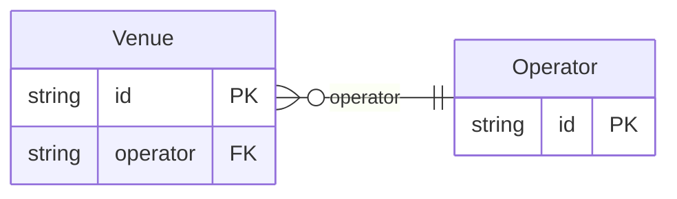

<!-- Code generated by protoc-gen-orm. DO NOT EDIT. -->

# `v1` — GORM models

Go structs with GORM struct tags — one package per schema.

Generated from Protobuf by protoc-gen-orm. Source of truth is the `.proto` files — regenerate rather than editing.

| Models | Enums |
| ---: | ---: |
| 2 | 1 |

## Entity relationships

## Output

- `<schema>/models.go` — one Go package per schema, one struct per table.
- `migrate.go` — a factory `Registry` (with a preloaded `Default`) that migrates every model in one call; emitted when the `go_module` opt is set. Call `Default.EnsureSchemas(db)` before `Default.Migrate(db)` so the schema-qualified tables have their Postgres schemas.
- Nullable columns are pointer types; proto enums become string-typed Go enums.
- Attach in main: `Default.EnsureSchemas(db)` then `Default.Migrate(db)`, or wire the structs into a `*gorm.DB` and run AutoMigrate yourself.
- `<schema>/<model>_store.go` — a typed CRUD store per resource (Create, GetByID, List, Count, Update, DeleteByID, plus GetBy/ListBy finders for unique and foreign-key columns); emitted when the `stores` opt is set (which also requires `go_module`). Requires `gorm.io/gorm`.
- `gormx/gormx.go` — the shared runtime every store imports: `ListOptions`, the generic `Store[M]` interface every store satisfies, a `GenericStore[M]` engine that runs CRUD for any model with no per-entity code, and `EnsureSchemas`. Lets one generic engine drive every entity.
- `telemetry/telemetry.go` — the first-party opentelementry adapter: `New(o)` wraps an SDK handle as the `gormx.Telemetry` the stores observe through (`WithTelemetry(telemetry.New(o))`), and `Plugin(o)` is the SQL-level gorm plugin. Emitted with the `telemetry` opt; requires `github.com/the-protobuf-project/opentelementry/opentelementry-go`.
- `Registry.Instrument(db, o)` in `migrate.go` — installs the generated telemetry gorm plugin so every query emits a span (and metric) through the SDK handle.

## Schema `venue_v1`

### `Venue` → `venues`

Venue exercises the filters emitter: type-derived kinds for every scalar shape (text, enum, date, timestamp, int, bool, tags), the search opt-in, the filterable/sortable opt-outs, a resource reference (equality-only Ref kind), and shapes that are always excluded (JSONB attributes, the synthesized key).

| Column | Type | Null |
| --- | --- | --- |
| `id` | `CHAR(26)` | not null |
| `name` | `VARCHAR(255)` | not null |
| `display_name` | `VARCHAR(255)` | not null |
| `operator` | `CHAR(26)` | not null |
| `kind` | `VenueKind` | not null |
| `capacity` | `INTEGER` | nullable |
| `open_air` | `BOOLEAN` | nullable |
| `licence_expiry` | `DATE` | nullable |
| `tags` | `VARCHAR(255)[]` | nullable |
| `internal_code` | `VARCHAR(255)` | nullable |
| `nonce` | `VARCHAR(255)` | nullable |
| `attributes` | `JSONB` | nullable |
| `create_time` | `TIMESTAMPTZ` | not null |

### `Operator` → `operators`

Operator is the referenced parent so the venue's reference resolves to a real table (a hard FK) instead of degrading to a soft reference.

| Column | Type | Null |
| --- | --- | --- |
| `id` | `CHAR(26)` | not null |
| `name` | `VARCHAR(255)` | not null |
| `display_name` | `VARCHAR(255)` | not null |

### Enums

- `VenueKind`: HALL, ARENA
