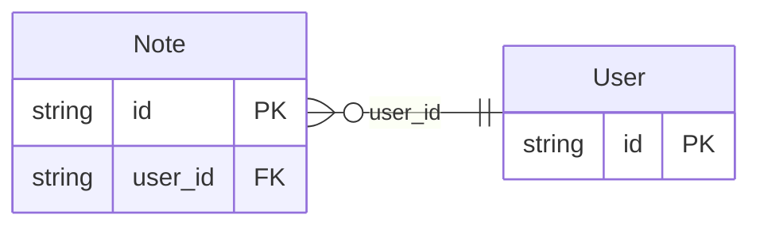

<!-- Code generated by protoc-gen-orm. DO NOT EDIT. -->

# `v1/` — Prisma schema

Generated from Protobuf by protoc-gen-orm. Source of truth is the `.proto` files — regenerate rather than editing.

| Models | Enums |
| ---: | ---: |
| 2 | 0 |

## Entity relationships

## Subfolders

- [`parentref/`](./parentref/README.md)
