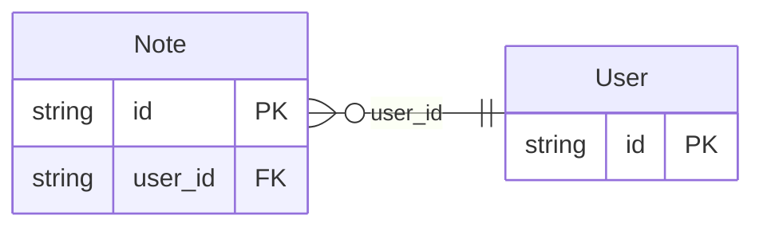

<!-- Code generated by protoc-gen-orm. DO NOT EDIT. -->

# `v1/parentref/` — Prisma schema

Generated from Protobuf by protoc-gen-orm. Source of truth is the `.proto` files — regenerate rather than editing.

| Models | Enums |
| ---: | ---: |
| 2 | 0 |

## Entity relationships

Schema file: [`parentref.postgres.prisma`](./parentref.postgres.prisma)

### `User` → `users`

User is the parent resource.

| Column | Type | Null |
| --- | --- | --- |
| `id` | `CHAR(26)` | not null |
| `name` | `VARCHAR(255)` | not null |
| `display_name` | `VARCHAR(255)` | not null |

### `Note` → `notes`

Note is owned by a User. Its pattern carries a {user} parent segment with no corresponding field, so orm materializes a user_id FK → User from the pattern alone.

| Column | Type | Null |
| --- | --- | --- |
| `id` | `CHAR(26)` | not null |
| `name` | `VARCHAR(255)` | not null |
| `body` | `VARCHAR(255)` | not null |
| `user_id` | `CHAR(26)` | not null |
