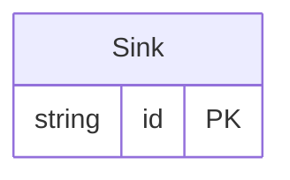

<!-- Code generated by protoc-gen-orm. DO NOT EDIT. -->

# `wkt_db/wkt/` — Prisma schema

Generated from Protobuf by protoc-gen-orm. Source of truth is the `.proto` files — regenerate rather than editing.

| Models | Enums |
| ---: | ---: |
| 1 | 0 |

## Entity relationships

Schema file: [`wkt.postgres.prisma`](./wkt.postgres.prisma)

### `Sink` → `sinks`

Sink is one table holding every interesting type mapping.

| Column | Type | Null |
| --- | --- | --- |
| `id` | `CHAR(26)` | not null |
| `name` | `VARCHAR(255)` | not null |
| `flag` | `BOOLEAN` | nullable |
| `count32` | `INTEGER` | nullable |
| `count64` | `BIGINT` | nullable |
| `ratio` | `REAL` | nullable |
| `precise` | `DOUBLE PRECISION` | nullable |
| `blob` | `BYTEA` | nullable |
| `event_time` | `TIMESTAMPTZ` | nullable |
| `window` | `INTERVAL` | nullable |
| `mask` | `TEXT` | nullable |
| `maybe_count` | `BIGINT` | nullable |
| `maybe_label` | `VARCHAR(255)` | nullable |
| `tags` | `VARCHAR(255)[]` | nullable |
| `scores` | `INTEGER[]` | nullable |
| `attributes` | `JSONB` | nullable |
