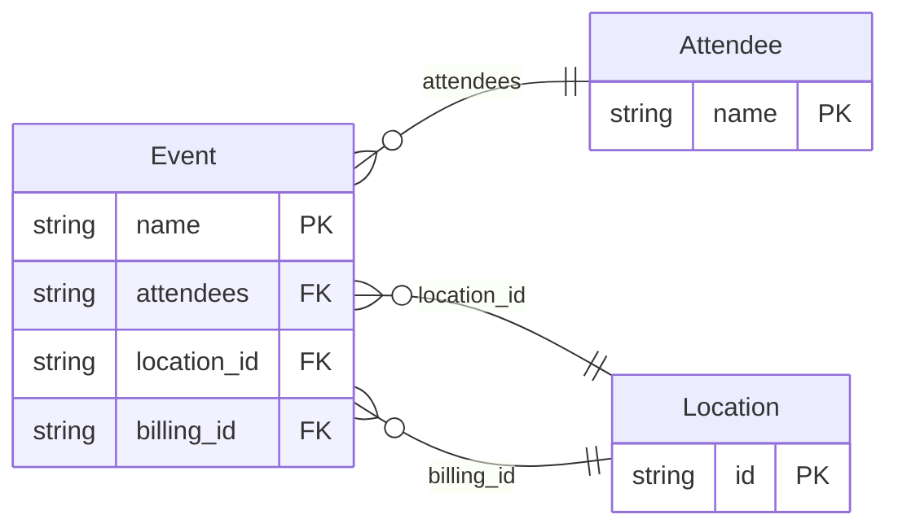

<!-- Code generated by protoc-gen-protorm. DO NOT EDIT. -->

# `v1/embedded/` — Prisma schema

Generated from Protobuf by protoc-gen-protorm. Source of truth is the `.proto` files — regenerate rather than editing.

| Models | Enums |
| ---: | ---: |
| 3 | 0 |

## Entity relationships

Schema file: [`embedded.postgres.prisma`](./embedded.postgres.prisma)

### `Event` → `events`

Event exercises nested-message normalization: a singular message field becomes a belongs-to relation, a repeated message field becomes a has-many, while well-known and map fields stay scalar / JSONB.

| Column | Type | Null |
| --- | --- | --- |
| `name` | `VARCHAR(255)` | not null |
| `attendees` | `VARCHAR(255)` | nullable |
| `create_time` | `TIMESTAMPTZ` | nullable |
| `labels` | `JSONB` | nullable |
| `location_id` | `VARCHAR(255)` | not null |
| `billing_id` | `VARCHAR(255)` | nullable |

### `Attendee` → `attendees`

Attendee carries an IDENTIFIER, so that field is its primary key.

| Column | Type | Null |
| --- | --- | --- |
| `name` | `VARCHAR(255)` | not null |
| `email` | `VARCHAR(255)` | not null |

### `Location` → `locations`

Location is reachable from Event and so becomes its own table; its existing `id` field is promoted to the primary key.

| Column | Type | Null |
| --- | --- | --- |
| `id` | `VARCHAR(255)` | not null |
| `city` | `VARCHAR(255)` | not null |
| `venue` | `VARCHAR(255)` | nullable |
