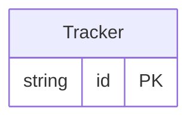

<!-- Code generated by protoc-gen-protorm. DO NOT EDIT. -->

# `fleet/fleet/` — Prisma schema

Generated from Protobuf by protoc-gen-protorm. Source of truth is the `.proto` files — regenerate rather than editing.

| Models | Enums |
| ---: | ---: |
| 1 | 0 |

## Entity relationships

Schema file: [`fleet.postgres.prisma`](./fleet.postgres.prisma)

### `Tracker` → `trackers`

Tracker is a fleet device resource. The layout config routes it to the "fleet" database, schema "fleet_tracking_device".

| Column | Type | Null |
| --- | --- | --- |
| `id` | `CHAR(26)` | not null |
| `name` | `VARCHAR(255)` | not null |
| `serial` | `VARCHAR(255)` | not null |
