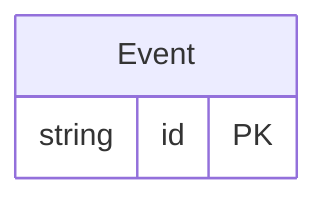

<!-- Code generated by protoc-gen-protorm. DO NOT EDIT. -->

# `events_db/mongo/` — Prisma schema

Generated from Protobuf by protoc-gen-protorm. Source of truth is the `.proto` files — regenerate rather than editing.

| Models | Enums |
| ---: | ---: |
| 1 | 0 |

## Entity relationships

Schema file: [`mongo.mongodb.prisma`](./mongo.mongodb.prisma)

### `Event` → `events`

Event is a document in the events collection.

| Column | Type | Null |
| --- | --- | --- |
| `id` | `CHAR(26)` | not null |
| `name` | `VARCHAR(255)` | not null |
| `kind` | `VARCHAR(255)` | not null |
| `payload` | `JSONB` | nullable |
| `occurrence_time` | `TIMESTAMPTZ` | nullable |
| `score` | `DOUBLE PRECISION` | nullable |
