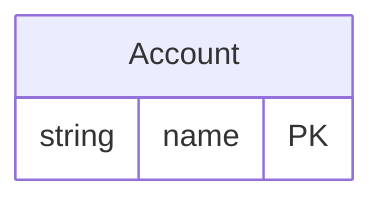

<!-- Code generated by protoc-gen-protorm. DO NOT EDIT. -->

# `reserved_db/reserved_words/` — Prisma schema

Generated from Protobuf by protoc-gen-protorm. Source of truth is the `.proto` files — regenerate rather than editing.

| Models | Enums |
| ---: | ---: |
| 1 | 1 |

## Entity relationships

Schema file: [`reserved_words.postgres.prisma`](./reserved_words.postgres.prisma)

### `Account` → `user`

Account is forced onto the reserved table name "user" via a table override, with reserved-word columns and a composite UNIQUE index over them.

| Column | Type | Null |
| --- | --- | --- |
| `name` | `VARCHAR(255)` | not null |
| `order` | `VARCHAR(255)` | nullable |
| `select` | `VARCHAR(255)` | nullable |
| `state` | `State` | nullable |

### Enums

- `State`: UNSPECIFIED, ACTIVE, CLOSED
